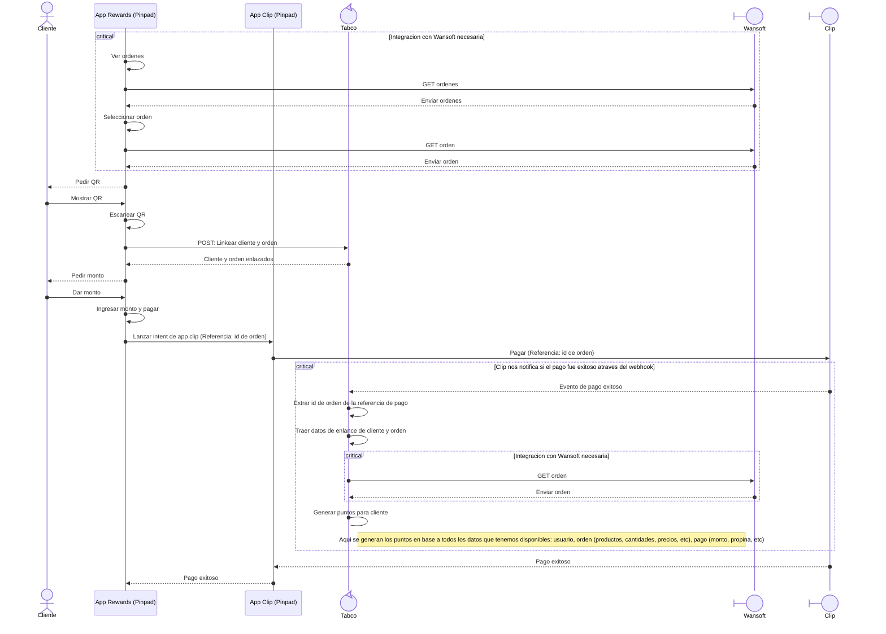

# Generacion de puntos

```mermaid
sequenceDiagram
    actor u as Cliente
    participant p as App Rewards (Pinpad)
    participant cp as App Clip (Pinpad)
    participant t@{ "type": "control" } as Tabco
    participant w@{ "type": "boundary" } as Wansoft
    participant c@{ "type": "boundary" } as Clip

    critical Integracion con Wansoft necesaria
        p ()->> p: Ver ordenes
        p ()->> w: GET ordenes
        w ()-->> p: Enviar ordenes
        p ()->> p: Seleccionar orden
        p ()->> w: GET orden
        w ()-->> p: Enviar orden
    end
    p ()-->> u: Pedir QR
    u ()->> p: Mostrar QR
    p ()->> p: Escanear QR
    p ()->> t: POST: Linkear cliente y orden
    t ()-->> p: Cliente y orden enlazados
    p ()-->> u: Pedir monto
    u ()->> p: Dar monto
    p ()->> p: Ingresar monto y pagar
    p ()->> cp: Lanzar intent de app clip (Referencia: id de orden)
    cp ()->> c: Pagar (Referencia: id de orden)
    critical Clip nos notifica si el pago fue exitoso atraves del webhook
        c ()-->> t: Evento de pago exitoso
        t ()->>t: Extrar id de orden de la referencia de pago
        t ()->>t: Traer datos de enlance de cliente y orden
        critical Integracion con Wansoft necesaria
            t ()->>w: GET orden
            w ()-->> t: Enviar orden
        end
        t ()->t: Generar puntos para cliente
        Note right of t: Aqui se generan los puntos en base a todos los datos que tenemos disponibles: usuario, orden (productos, cantidades, precios, etc), pago (monto, propina, etc)
    end
    c ()-->>cp: Pago exitoso
    cp ()-->>p: Pago exitoso
```

## Preguntas

1. Existe un api de Wansoft, que podemos usar para conseguir datos de ordenes, productos, etc.?
3. Si existe cual es la manera de conectarse, api key, etc.?
